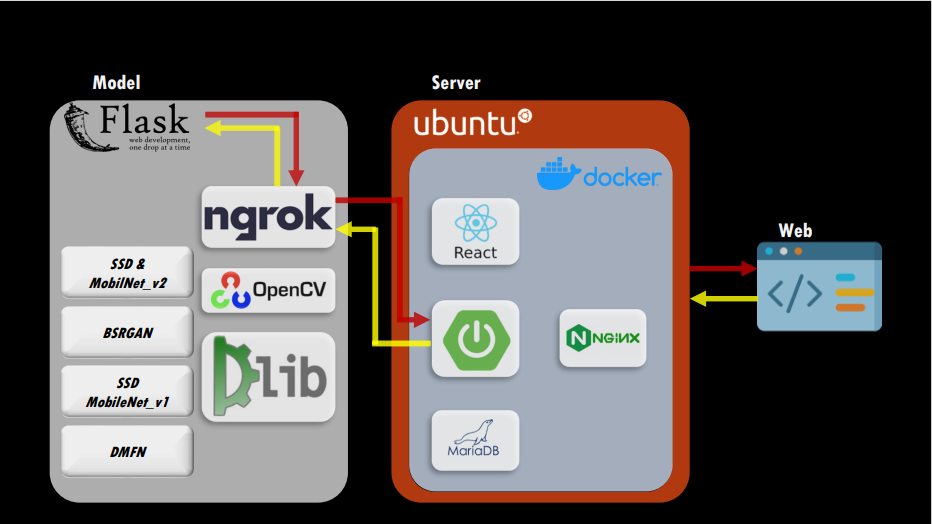

# 마스크 착용 얼굴 식별 프로젝트 - Backend Part

### 소개
***
2022 1학기 캡스톤 프로젝트로 진행된 마스크 착용 얼굴 식별 프로젝트 Backend Part 저장소 입니다. 

프로젝트에 대한 자세한 사항은 [발표자료 pdf](file.pdf) 를 참고해 주세요

### 개발자
***
- [김동균](https://github.com/oldaim) - Backend 
- [김정호](https://github.com/cloud0406) - Frontend 

### 기술 스택
***
- Language: **Java 11**
- Server Framework: **Spring Boot 2.6.4**
- IDE: **Intellij IDEA**
- CI/CD : **Jenkins 2.345** , **Docker** , **Ubuntu**
- Dependency Management: **Gradle-7.1.1**

### 주요 기능 
***
Backend 파트의 기능은 입력받은 데이터 저장과  모듈간의 데이터 전달의 집중하여 설계되었습니다.

- UserService : 회원가입과 로그인 기능을 담당합니다.
- TargetService : 화면으로 부터 받은 정보를 저장하고 조회합니다. 
- ImageService : 이미지 저장, 조회, 삭제 기능을 담당합니다.
- WebClientService : 화면에서 받아 저장한 데이터를 모델로 전송합니다.
- ReturnInfoService : 모델에서 분석이 끝나고 반환 받은 정보를 저장하고 조회하는 기능을 담당합니다.

### 프로젝트 구조 
***

